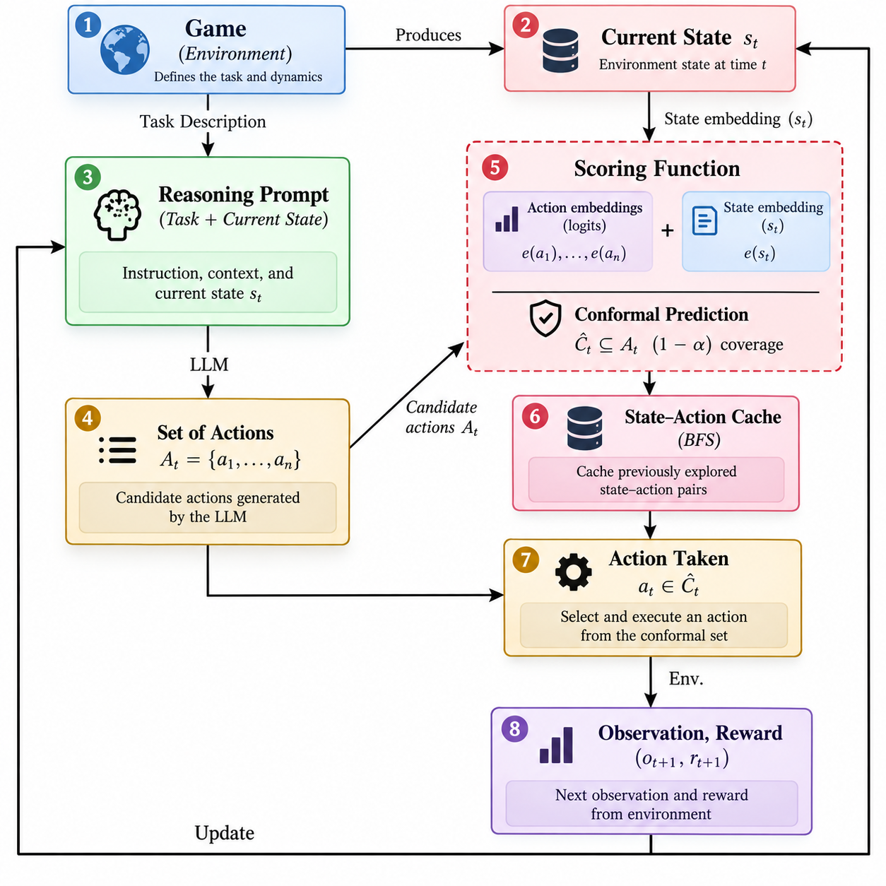

# Official Repo of Conf-ReAct- User-Controlled Tradeoffs in LLM Agent Reasoning via Conformal Prediction


To get started:

1. Clone this repo:
```bash
https://github.com/Sap98/Conf-ReAct-_User-Controlled_Tradeoffs_in_LLM_Agent_Reasoning_via_Conformal_Prediction.git
```
